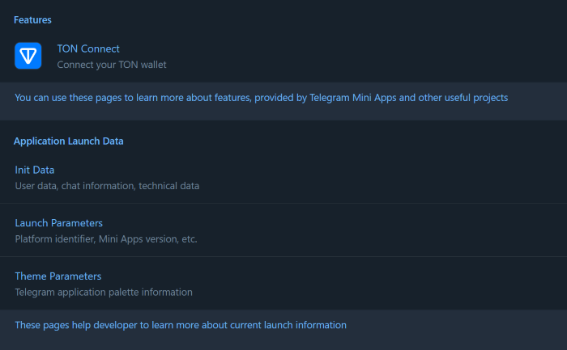

# Telegram Mini Apps React Template

This template demonstrates how developers can implement a single-page
application on the Telegram Mini Apps platform using the following technologies
and libraries:

- [React](https://react.dev/)
- [TypeScript](https://www.typescriptlang.org/)
- [TON Connect](https://docs.ton.org/develop/dapps/ton-connect/overview)
- [@telegram-apps SDK](https://docs.telegram-mini-apps.com/packages/telegram-apps-sdk/2-x)
- [Telegram UI](https://github.com/Telegram-Mini-Apps/TelegramUI)
- [Vite](https://vitejs.dev/)

> The template was created using [npm](https://www.npmjs.com/). Therefore, it is
> required to use it for this project as well. Using other package managers, you
> will receive a corresponding error.

## Install Dependencies

If you have just cloned this template, you should install the project
dependencies using the command:

```Bash
npm install
```

## Scripts

This project contains the following scripts:

- `dev`. Runs the application in development mode.
- `dev:https`. Runs the application in development mode using locally created valid SSL-certificates.
- `build`. Builds the application for production.
- `lint`. Runs [eslint](https://eslint.org/) to ensure the code quality meets
  the required standards.
- `deploy`. Deploys the application to GitHub Pages.

To run a script, use the `npm run` command:

```Bash
npm run {script}
# Example: npm run build
```

## Create Bot and Mini App

Before you start, make sure you have already created a Telegram Bot. Here is
a [comprehensive guide](https://docs.telegram-mini-apps.com/platform/creating-new-app)
on how to do it.

## Run

Although Mini Apps are designed to be opened
within [Telegram applications](https://docs.telegram-mini-apps.com/platform/about#supported-applications),
you can still develop and test them outside of Telegram during the development
process.

To run the application in the development mode, use the `dev` script:

```bash
npm run dev:https
```

> [!NOTE]
> As long as we use [vite-plugin-mkcert](https://www.npmjs.com/package/vite-plugin-mkcert),
> launching the dev mode for the first time, you may see sudo password request.
> The plugin requires it to properly configure SSL-certificates. To disable the plugin, use the `npm run dev` command.

After this, you will see a similar message in your terminal:

```bash
VITE v5.2.12  ready in 237 ms

➜  Local:   https://localhost:5173/reactjs-template
➜  Network: https://172.18.16.1:5173/reactjs-template
➜  Network: https://172.19.32.1:5173/reactjs-template
➜  Network: https://192.168.0.171:5173/reactjs-template
➜  press h + enter to show help
```

Here, you can see the `Local` link, available locally, and `Network` links
accessible to all devices in the same network with the current device.

To view the application, you need to open the `Local`
link (`https://localhost:5173/reactjs-template` in this example) in your
browser:



It is important to note that some libraries in this template, such as
`@telegram-apps/sdk`, are not intended for use outside of Telegram.

Nevertheless, they appear to function properly. This is because the
`src/mockEnv.ts` file, which is imported in the application's entry point (
`src/index.ts`), employs the `mockTelegramEnv` function to simulate the Telegram
environment. This trick convinces the application that it is running in a
Telegram-based environment. Therefore, be cautious not to use this function in
production mode unless you fully understand its implications.

> [!WARNING]
> Because we are using self-signed SSL certificates, the Android and iOS
> Telegram applications will not be able to display the application. These
> operating systems enforce stricter security measures, preventing the Mini App
> from loading. To address this issue, refer to
> [this guide](https://docs.telegram-mini-apps.com/platform/getting-app-link#remote).

## Deploy

This boilerplate uses GitHub Pages as the way to host the application
externally. GitHub Pages provides a CDN which will let your users receive the
application rapidly. Alternatively, you could use such services
as [Heroku](https://www.heroku.com/) or [Vercel](https://vercel.com).

### Manual Deployment

This boilerplate uses the [gh-pages](https://www.npmjs.com/package/gh-pages)
tool, which allows deploying your application right from your PC.

#### Configuring

Before running the deployment process, ensure that you have done the following:

1. Replaced the `homepage` value in `package.json`. The GitHub Pages deploy tool
   uses this value to
   determine the related GitHub project.
2. Replaced the `base` value in `vite.config.ts` and have set it to the name of
   your GitHub
   repository. Vite will use this value when creating paths to static assets.

For instance, if your GitHub username is `telegram-mini-apps` and the repository
name is `is-awesome`, the value in the `homepage` field should be the following:

```json
{
  "homepage": "https://telegram-mini-apps.github.io/is-awesome"
}
```

And `vite.config.ts` should have this content:

```ts
export default defineConfig({
  base: '/is-awesome/',
  // ...
});
```

You can find more information on configuring the deployment in the `gh-pages`
[docs](https://github.com/tschaub/gh-pages?tab=readme-ov-file#github-pages-project-sites).

#### Before Deploying

Before deploying the application, make sure that you've built it and going to
deploy the fresh static files:

```bash
npm run build
```

Then, run the deployment process, using the `deploy` script:

```Bash
npm run deploy
```

After the deployment completed successfully, visit the page with data according
to your username and repository name. Here is the page link example using the
data mentioned above:
https://telegram-mini-apps.github.io/is-awesome

### GitHub Workflow

To simplify the deployment process, this template includes a
pre-configured [GitHub workflow](.github/workflows/github-pages-deploy.yml) that
automatically deploys the project when changes are pushed to the `master`
branch.

To enable this workflow, create a new environment (or edit the existing one) in
the GitHub repository settings and name it `github-pages`. Then, add the
`master` branch to the list of deployment branches.

You can find the environment settings using this
URL: `https://github.com/{username}/{repository}/settings/environments`.


In case, you don't want to do it automatically, or you don't use GitHub as the
project codebase, remove the `.github` directory.

### GitHub Web Interface

Alternatively, developers can configure automatic deployment using the GitHub
web interface. To do this, follow the link:
`https://github.com/{username}/{repository}/settings/pages`.

## TON Connect

This boilerplate utilizes
the [TON Connect](https://docs.ton.org/develop/dapps/ton-connect/overview)
project to demonstrate how developers can integrate functionality related to TON
cryptocurrency.

The TON Connect manifest used in this boilerplate is stored in the `public`
folder, where all publicly accessible static files are located. Remember
to [configure](https://docs.ton.org/develop/dapps/ton-connect/manifest) this
file according to your project's information.

## Useful Links

- [Platform documentation](https://docs.telegram-mini-apps.com/)
- [@telegram-apps/sdk-react documentation](https://docs.telegram-mini-apps.com/packages/telegram-apps-sdk-react)
- [Telegram developers community chat](https://t.me/devs)

# Croakkingdom

A TON blockchain-based application with NFT minting, staking, and gaming features.

## Features

### 🎁 Airdrop Registration System
- **Multi-step wizard** for collecting user information
- **Social media integration** (Telegram, Twitter, Telegram Channel)
- **STKN to STK conversion calculator** (1 STK = 100,000 STKN)
- **Permanent storage** in Supabase database
- **Progress saving** and recovery
- **Admin panel** for managing registrations
- **Validation and error handling**

### 🏦 Staking System
- **Dynamic ROI rates** based on stake duration
- **Speed boost multipliers** for enhanced earnings
- **Cycle completion tracking** (300% max return)
- **Automatic rank progression** based on earnings
- **Referral system** with multi-level commissions

### 🎯 Referral System
- **Multi-level commission structure** (5 levels deep)
- **Team volume tracking** and bonuses
- **Fast start bonuses** for quick referrals
- **Rank-based commission rates**

### 💎 NFT Minting
- **TON Fortune Stakers NFT** collection
- **Progress saving** tied to wallet addresses
- **Minting status tracking** with visual indicators
- **Automatic airdrop wizard** after successful mint

### 🏆 Global Leadership Pool (GLP)
- **Weekly reward distributions** based on team performance
- **Withdrawal volume tracking** for GLP eligibility
- **Dynamic point calculation** system
- **Automatic reward processing**

### ⛏️ Mining System
- **SBT token mining** with daily rewards
- **Mining power calculation** based on deposits
- **Active mining status tracking**
- **Reward distribution** system

### 📊 User Management
- **Telegram integration** for seamless authentication
- **Wallet address management** and validation
- **User profile tracking** with detailed statistics
- **Activity logging** and monitoring

### 🔧 Technical Features
- **Real-time updates** using Supabase subscriptions
- **Error recovery** and retry mechanisms
- **Rate limiting** and validation
- **Responsive design** for mobile and desktop
- **TypeScript** for type safety
- **Tailwind CSS** for styling

## Database Schema

### Core Tables
- **users** - User profiles and authentication
- **stakes** - Staking records and earnings
- **deposits** - Deposit transactions
- **withdrawals** - Withdrawal transactions
- **referrals** - Referral relationships
- **airdrop_registrations** - Airdrop form submissions

### Supporting Tables
- **global_pool_shares** - GLP participation tracking
- **rank_rewards** - Weekly rank bonuses
- **speed_boosts** - Speed boost activations
- **mining_deposits** - Mining activity records
- **earning_logs** - Detailed earning history

## Airdrop Registration System

The airdrop registration system provides a comprehensive solution for collecting and managing user information for future airdrops:

### Features
- **Multi-step wizard** with social media integration
- **STKN to STK conversion** calculator (1 STK = 100,000 STKN)
- **Permanent storage** in Supabase database
- **Admin panel** for managing registrations
- **Status tracking** (pending, approved, rejected, completed)

### Database Schema
```sql
CREATE TABLE airdrop_registrations (
  id UUID PRIMARY KEY DEFAULT uuid_generate_v4(),
  user_id UUID REFERENCES users(id) NOT NULL,
  wallet_address TEXT NOT NULL,
  email TEXT NOT NULL,
  telegram_username TEXT NOT NULL,
  twitter_username TEXT NOT NULL,
  stkn_amount NUMERIC NOT NULL,
  stk_amount NUMERIC NOT NULL,
  social_connections JSONB NOT NULL DEFAULT '{}',
  registration_status TEXT DEFAULT 'pending',
  created_at TIMESTAMP WITH TIME ZONE DEFAULT NOW(),
  updated_at TIMESTAMP WITH TIME ZONE DEFAULT NOW(),
  UNIQUE(user_id, wallet_address)
);
```

### Admin Functions
- **View all registrations** with filtering by status
- **Update registration status** (pending → approved → completed)
- **Export registration data** for airdrop processing
- **Monitor social media connections** and token amounts

### User Experience
- **Seamless integration** with NFT minting flow
- **Progress saving** and recovery
- **Real-time validation** and error handling
- **Mobile-responsive** design
- **Already registered** detection and messaging

## Local Storage Keys

The application uses localStorage for temporary progress tracking:

- `tonFortuneMintProgress_{walletAddress}` - Minting progress and status
- Airdrop form data is now permanently stored in Supabase database

## Environment Variables

Required environment variables for Supabase integration:

```env
VITE_SUPABASE_URL=your_supabase_url
VITE_SUPABASE_ANON_KEY=your_supabase_anon_key
```

## Installation and Setup

1. **Clone the repository**
   ```bash
   git clone <repository-url>
   cd Croakkingdom
   ```

2. **Install dependencies**
   ```bash
   npm install
   ```

3. **Set up environment variables**
   ```bash
   cp .env.example .env
   # Edit .env with your Supabase credentials
   ```

4. **Run database migrations**
   ```sql
   -- Execute the SQL from database.sql in your Supabase SQL editor
   ```

5. **Start the development server**
   ```bash
   npm run dev
   ```

## Database Setup

1. **Create Supabase project** and get your credentials
2. **Execute the SQL schema** from `database.sql`
3. **Set up Row Level Security (RLS)** policies
4. **Configure real-time subscriptions** for live updates

## Admin Access

To access the airdrop admin panel, you can temporarily add a button to the main page or create a separate admin route. The admin component (`AirdropAdmin.tsx`) provides full management capabilities for airdrop registrations.

## Contributing

1. Fork the repository
2. Create a feature branch
3. Make your changes
4. Test thoroughly
5. Submit a pull request

## License

This project is licensed under the MIT License - see the LICENSE file for details.
